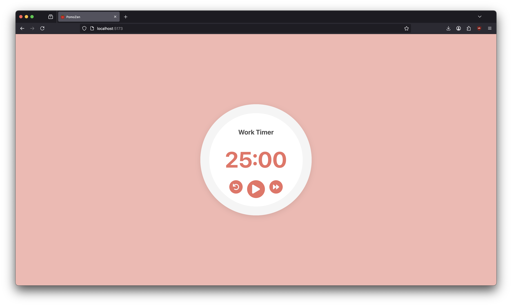
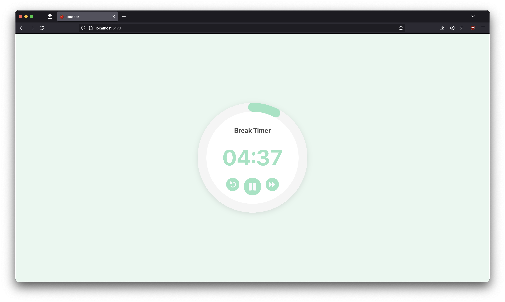

# PomoZen

A simple, beautiful Pomodoro timer app built with React.

## Features

- **Work & Break Cycles:** Switches automatically between work and break intervals.
- **Circular Progress Bar:** Visual progress indicator using `react-circular-progressbar`.
- **Sound Notifications:** Plays a sound when switching between work and break.
- **Responsive Design:** Looks great on desktop and mobile.
- **Controls:** Play/Pause, Reset, and Skip buttons for easy timer management.

## Screenshots

### Work Cycle



### Break Cycle



## Getting Started

### Prerequisites

- [Node.js](https://nodejs.org/) (v14 or newer recommended)
- [npm](https://www.npmjs.com/) or [yarn](https://yarnpkg.com/)

### Installation

1. **Clone the repository:**
   ```sh
   git clone https://github.com/yourusername/pomozen.git
   cd pomozen
   ```

2. **Install dependencies:**
   ```sh
   npm install
   # or
   yarn install
   ```

3. **Start the development server:**
   ```sh
   npm start
   # or
   yarn start
   ```

4. Open [http://localhost:3000](http://localhost:3000) in your browser.

## Usage

- Click the **Play** button to start the timer.
- Use **Pause**, **Reset**, or **Skip** as needed.
- The timer will automatically switch between work and break sessions.

## Customization

- **Timer Lengths:** Edit `WORK_TIME` and `BREAK_TIME` in `src/components/pomodoro.jsx` to change durations.
- **Sounds:** Replace `here-we-go-again.mp3` and `wow.mp3` in the `public` folder with your own notification sounds.
- **Styling:** Modify `src/App.css` for custom themes and styles.

## Dependencies

- [React](https://reactjs.org/)
- [react-circular-progressbar](https://www.npmjs.com/package/react-circular-progressbar)

## License

MIT

---

Made with ❤️ for productivity!
